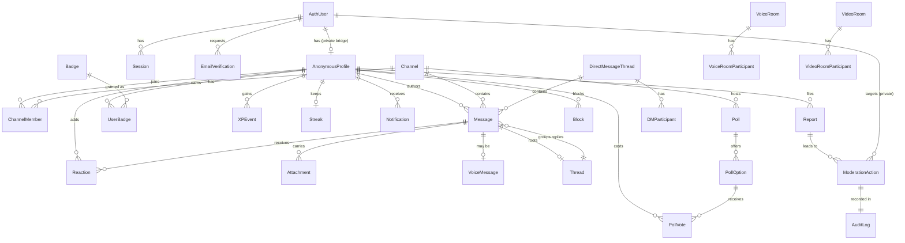

# Cloak — Database Design

PostgreSQL, accessed through Prisma. The schema deliberately **splits identity in
two** and never stores the anonymous↔real link anywhere a normal query path can
reach.

## 1. The two-identity split (the core privacy invariant)

```
        INTERNAL (accountable)                        PUBLIC (anonymous)
   ┌──────────────────────────────┐            ┌──────────────────────────────┐
   │           AuthUser           │  1      1  │        AnonymousProfile        │
   │  id (uuid, internal)         │──────────► │  id (uuid, PUBLIC)            │
   │  email  (UNIQUE, @snapdeal)  │            │  username (UNIQUE)            │
   │  emailNormalized             │            │  avatarKind / avatarSeed      │
   │  employeeId (nullable)       │            │  bio, karma, xp, level        │
   │  role (USER/MOD/ADMIN)       │            │  presenceVisible              │
   │  status (ACTIVE/SUSPENDED..) │            │  createdAt                    │
   └──────────────────────────────┘            └──────────────────────────────┘
     ▲ only auth + moderation                    ▲ everything the community sees
       modules read this side                      references THIS id everywhere
```

- Every public entity (Message, Reaction, Vote, …) references **`AnonymousProfile.id`**,
  never `AuthUser.id`.
- The only rows that hold `authUserId` are `AnonymousProfile` (the bridge) and the
  auth/moderation tables. The API response mapper is forbidden from serializing
  `authUserId`.
- Identity **unmasking** (real name/email from a profile) is a dedicated
  moderation service call that requires an elevated role and writes an `AuditLog`
  row every time — there is no read endpoint that returns it casually.

## 2. ER diagram



## 3. Entity notes, indexes & constraints

- **AuthUser** — `email` UNIQUE + `emailNormalized` UNIQUE (lowercased, dot/plus
  handling). CHECK-style guard on domain enforced in app + partial index. `role`,
  `status` enums.
- **AnonymousProfile** — `username` UNIQUE (citext-style, case-insensitive).
  `authUserId` UNIQUE FK (1:1). Index on `karma`, `xp` for leaderboards.
- **Session** — stores **hashed** refresh token (`tokenHash`), `deviceLabel`,
  `ip`, `userAgent`, `expiresAt`, `revokedAt`. Index `(authUserId, revokedAt)`.
  Rotation: on refresh, old row `revokedAt=now`, new row inserted (reuse of a
  revoked token ⇒ revoke whole family = theft detection).
- **EmailVerification** — `codeHash`, `expiresAt`, `attempts`, `consumedAt`.
  Rate-limited per email; max attempts enforced then invalidated.
- **Channel** — `slug` UNIQUE, `visibility` (PUBLIC/PRIVATE), `isArchived`,
  `topic`, `description`. Index `(visibility, isArchived)`.
- **ChannelMember** — composite UNIQUE `(channelId, profileId)`; `role`
  (OWNER/ADMIN/MEMBER), `notificationLevel`, `lastReadMessageId`. Index
  `(profileId)` for a user's channel list.
- **Message** — `channelId`|`dmThreadId` (exactly one, CHECK), `authorId`,
  `threadId` (nullable → belongs to a thread), `parentId` (reply), `body`,
  `contentType`, `editedAt`, `deletedAt` (soft delete), `createdAt`.
  Key indexes for **cursor pagination**: `(channelId, createdAt DESC, id DESC)` and
  `(threadId, createdAt)`. FTS `GIN` index on `to_tsvector(body)` for search.
- **Thread** — `rootMessageId`, `replyCount`, `lastReplyAt`, subscribers via
  `ThreadSubscription`.
- **Reaction** — composite UNIQUE `(messageId, profileId, emoji)` so a user can't
  double-count the same emoji; toggling deletes the row. Index `(messageId)`.
- **Attachment** — `storageKey`, `mime`, `size`, `kind`, `status`
  (PENDING/READY/REJECTED), `thumbnailKey`, `width/height/duration`.
- **VoiceMessage** — `attachmentId`, `durationMs`, `waveform` (int[]),
  `downloadable` (default false).
- **Poll / PollOption / PollVote** — `PollVote` UNIQUE `(pollId, profileId, optionId)`;
  `Poll.mode` SINGLE/MULTI, `anonymous`, `expiresAt`.
- **Notification** — `recipientId`, `type`, `payload` (jsonb, anonymized), `readAt`.
  Index `(recipientId, readAt, createdAt DESC)`.
- **NotificationPreference** — per profile + optional per channel: ALL / MENTIONS /
  IMPORTANT / NOTHING.
- **Report** — `reporterId`, `targetType` (MESSAGE/USER), `targetId`, `reason`,
  `status`. **Block** — UNIQUE `(blockerId, blockedId)`.
- **ModerationAction** — `moderatorAuthUserId`, `action` (WARN/MUTE/CHANNEL_BAN/
  SUSPEND/BAN/DELETE_MESSAGE/UNMASK_IDENTITY), `targetAuthUserId` (private),
  `reason`, `expiresAt`.
- **AuditLog** — append-only: `actorAuthUserId`, `action`, `subjectType`,
  `subjectId`, `metadata` (jsonb), `ip`, `createdAt`. **Every identity unmask
  writes here.**
- **XPEvent** — `profileId`, `type`, `amount`, `sourceType/sourceId` (idempotent
  per source to prevent farming). **Streak** — `current`, `longest`, `lastActiveOn`.
- **Badge** (admin-configurable) — `key`, `name`, `emoji`, `description`,
  `criteria` (jsonb). **UserBadge** — UNIQUE `(profileId, badgeId)`.

## 4. Transaction boundaries (examples)

- **Verify OTP → first login**: within one transaction — consume verification,
  create `AuthUser` (if new), create unique `AnonymousProfile` (retry on username
  collision), create `Session`. All-or-nothing.
- **Send threaded reply**: insert `Message` + `Thread.replyCount++` +
  `Thread.lastReplyAt` in one transaction.
- **Refresh rotation**: revoke old `Session`, insert new one atomically.
- **Cast poll vote**: insert `PollVote` under the `(pollId, profileId)` uniqueness,
  respecting SINGLE vs MULTI.

## 5. Anti-patterns explicitly avoided

- ❌ One giant `users` table. ✅ `AuthUser` (private) vs `AnonymousProfile` (public)
  are separate tables with a guarded 1:1 bridge.
- ❌ Storing email on message rows for convenience. ✅ Messages only know `authorId`
  (a profile id).
- ❌ N+1 on message lists. ✅ Batched includes + dataloader-style reaction/author
  hydration; cursor pagination over an ordered composite index.
